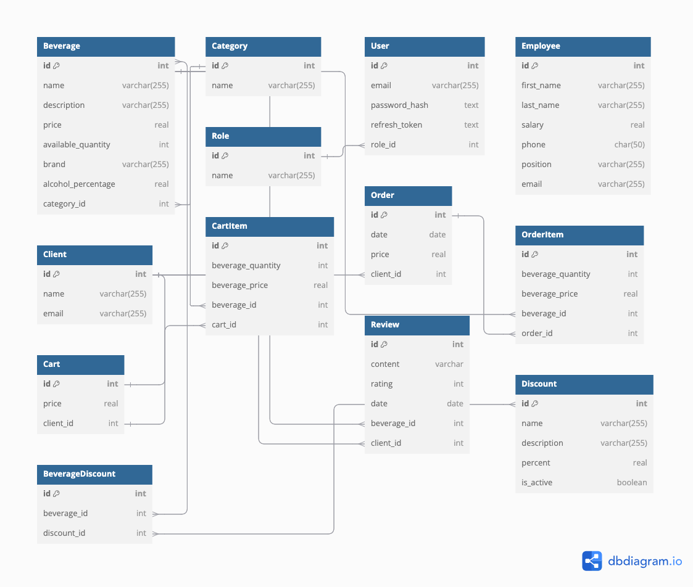

# Косяков Матвей гр. 253505

# Online store of alcoholic beverages
# DBSM: PostgreSQL

## Функциональные требования:

1. Авторизация/аутентификация пользователя.
2. Управление пользователями (CRUD).
3. Система ролей.
4. Журналирование действий пользователя.
5. Типы пользователей и их возможности:

    - **Неавторизованный пользователь**:
        + Просматривать каталог алкогольных напитков;
        + Фильтровать напитки по категории;

    - **Клиент** (то же, что и неавторизованный, а также):
        + Добавлять напитки в корзину;
        + Оформлять заказ;
        + Оставлять отзыв;
        + Смотреть все отзывы;

    - **Сотрудник**:
        + Управлять напитками (CRUD);
        + Управлять акциями (CRUD);
        + Просматривать информацию о заказах;

    - **Админ**:
        + Просматривать информацию о всех пользователях;
        + Просматривать логи;

## Таблицы базы данных:

## Сущности:

1. **Beverage**
   - *id*: INT (Primary Key)
   - *name*: VARCHAR(255)
   - *description*: VARCHAR(255)
   - *price*: DECIMAL(10, 2)
   - *available_quantity*: INT
   - *brand*: VARCHAR(255)
   - *alcohol_percentage*: DECIMAL(5, 2)
   - *created_at* TIMESTAMP
   - *updated_at* TIMESTAMP
   - *category_id*: INT (One-To-Many)

2. **Category**
   - *id*: INT (Primary Key)
   - *name*: VARCHAR(255)
   - *created_at* TIMESTAMP

3. **User**
   - *id*: INT (Primary Key)
   - *email*: VARCHAR(255)
   - *password_hash*: TEXT
   - *created_at* TIMESTAMP
   - *updated_at* TIMESTAMP
   - *role_id*: INT (One-To-Many)

4. **Employee**
   - *id*: INT (Primary Key)
   - *first_name*: VARCHAR(255)
   - *last_name*: VARCHAR(255)
   - *salary*: DECIMAL(10, 2)
   - *phone*: CHAR(50)
   - *position*: VARCHAR(255)
   - *email*: VARCHAR(255)
   - *created_at* TIMESTAMP
   - *updated_at* TIMESTAMP

5. **Client**
   - *id*: INT (Primary Key)
   - *name*: VARCHAR(255)
   - *email*: VARCHAR(255)
   - *created_at* TIMESTAMP
   - *updated_at* TIMESTAMP

6. **Role**
   - *id*: INT (Primary Key)
   - *name*: VARCHAR(255)
   - *created_at* TIMESTAMP

7. **Order**
   - *id*: INT (Primary Key)
   - *price*: DECIMAL(10, 2)
   - *created_at* TIMESTAMP
   - *updated_at* TIMESTAMP
   - *client_id*: INT (One-To-Many)

8. **OrderItem**
   - *id*: INT (Primary Key)
   - *beverage_quantity*: INT
   - *beverage_price*: DECIMAL(10, 2)
   - *created_at* TIMESTAMP
   - *updated_at* TIMESTAMP
   - *beverage_id*: INT (One-To-Many)
   - *order_id*: INT (One-To-Many)

9. **Cart**
   - *id*: INT (Primary Key)
   - *price*: DECIMAL(10, 2)
   - *created_at* TIMESTAMP
   - *updated_at* TIMESTAMP
   - *client_id*: INT (One-To-One)

10. **CartItem**
    - *id*: INT (Primary Key)
    - *beverage_quantity*: INT
    - *beverage_price*: DECIMAL(10, 2)
    - *created_at* TIMESTAMP
    - *updated_at* TIMESTAMP
    - *beverage_id*: INT (One-To-Many)
    - *cart_id*: INT (One-To-Many)

11. **Review**
    - *id*: INT (Primary Key)
    - *content*: TEXT
    - *rating*: INT
    - *created_at* TIMESTAMP
    - *updated_at* TIMESTAMP
    - *beverage_id*: INT (One-To-Many)
    - *client_id*: INT (One-To-Many)

12. **Discount**
    - *id*: INT (Primary Key)
    - *name*: VARCHAR(255)
    - *description*: VARCHAR(255)
    - *percent*: DECIMAL(5, 2)
    - *is_active*: BOOLEAN
    - *created_at* TIMESTAMP

13. **BeverageDiscount**
    - *id*: INT (Primary Key)
    - *created_at* TIMESTAMP
    - *updated_at* TIMESTAMP
    - *beverage_id*: INT (Many-To-Many)
    - *discount_id*: INT (Many-To-Many)
