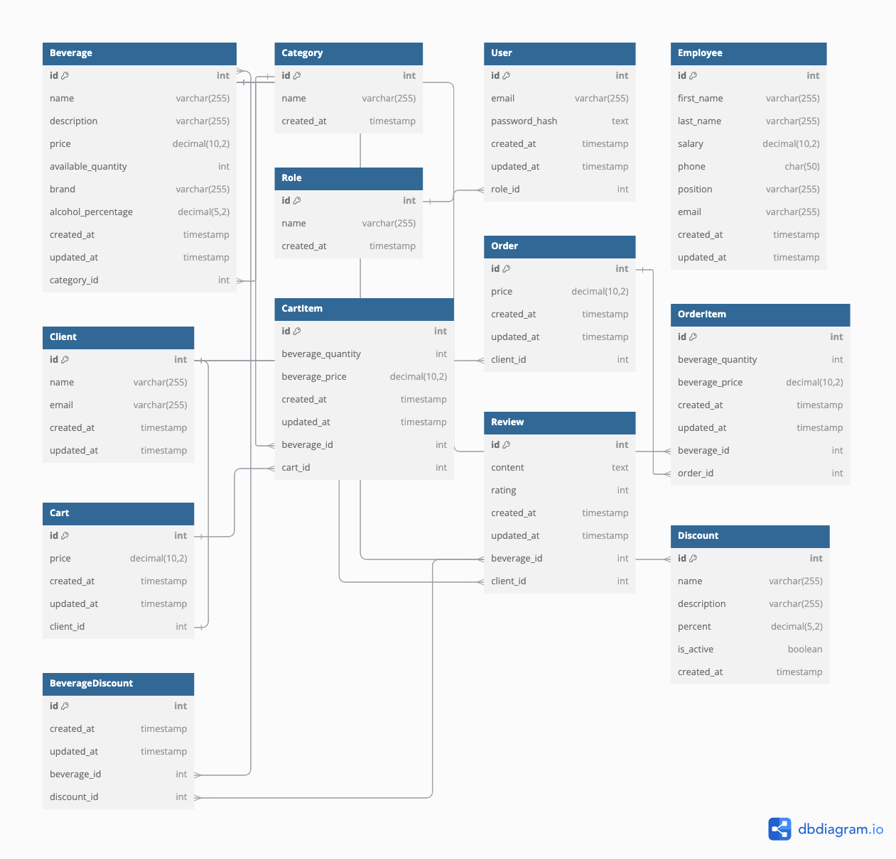

# Косяков Матвей гр. 253505

# Online store of alcoholic beverages
# DBSM: PostgreSQL

## Функциональные требования:

1. Авторизация/аутентификация пользователя.
2. Управление пользователями (CRUD).
3. Система ролей.
4. Журналирование действий пользователя.
5. Типы пользователей и их возможности:

    - **Неавторизованный пользователь**:
        + Может просматривать каталог алкогольных напитков;
        + Может фильтровать напитки по различным параметрам;

    - **Клиент** (то же, что и неавторизованный, а также):
        + Добавлять напитки в корзину;
        + Оформлять заказ;

    - **Сотрудник**:
        + Управлять напитками и категориями (CRUD);
        + Управлять акциями (CRUD);
        + Просматривать информацию о пользователях и заказах;

## Таблицы базы данных:

## Сущности:

1. **Beverage**
   - *id*: INT (Primary Key)
   - *name*: VARCHAR(255)
   - *description*: VARCHAR(255)
   - *price*: REAL
   - *available_quantity*: INT
   - *brand*: VARCHAR(255)
   - *alcohol_percentage*: REAL
   - *category_id*: INT (One-To-Many)

2. **Category**
   - *id*: INT (Primary Key)
   - *name*: VARCHAR(255)

3. **User**
   - *id*: INT (Primary Key)
   - *email*: VARCHAR(255)
   - *password_hash*: TEXT
   - *refresh_token*: TEXT
   - *role_id*: INT (One-To-Many)

4. **Employee**
   - *id*: INT (Primary Key)
   - *first_name*: VARCHAR(255)
   - *last_name*: VARCHAR(255)
   - *salary*: REAL
   - *phone*: CHAR(50)
   - *position*: VARCHAR(255)
   - *email*: VARCHAR(255)

5. **Client**
   - *id*: INT (Primary Key)
   - *name*: VARCHAR(255)
   - *email*: VARCHAR(255)

6. **Role**
   - *id*: INT (Primary Key)
   - *name*: VARCHAR(255)

7. **Order**
   - *id*: INT (Primary Key)
   - *date*: DATE
   - *price*: REAL
   - *client_id*: INT (One-To-Many)

8. **OrderItem**
   - *id*: INT (Primary Key)
   - *beverage_quantity*: INT
   - *beverage_price*: REAL
   - *beverage_id*: INT (One-To-Many)
   - *order_id*: INT (One-To-Many)

9.  **Cart**
    - *id*: INT (Primary Key)
    - *price*: REAL
    - *client_id*: INT (One-To-One)

10. **CartItem**
    - *id*: INT (Primary Key)
    - *beverage_quantity*: INT
    - *beverage_price*: REAL
    - *beverage_id*: INT (One-To-Many)
    - *cart_id*: INT (One-To-Many)

11. **Review**
    - *id*: INT (Primary Key)
    - *content*: VARCHAR
    - *rating*: INT
    - *date*: DATE
    - *beverage_id*: INT (One-To-Many)
    - *client_id*: INT (One-To-Many)

12.  **Discount**
     - *id*: INT (Primary Key)
     - *name*: VARCHAR(255)
     - *description*: VARCHAR(255)
     - *percent*: REAL
     - *is_active*: BOOLEAN

13.  **BeverageDiscount**
     - *id*: INT (Primary Key)
     - *beverage_id*: INT (Many-To-Many)
     - *discount_id*: INT (Many-To-Many)
